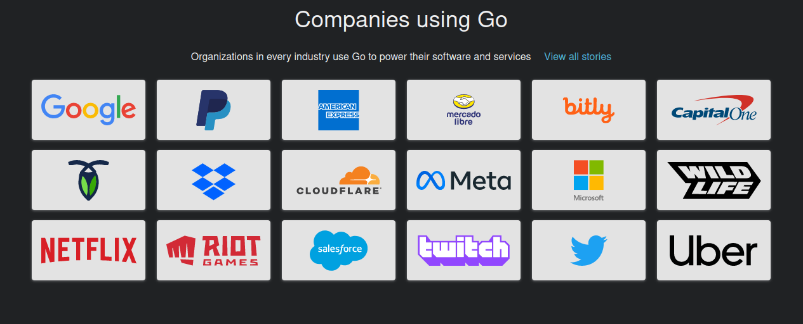

# Sejarah GoLang

Golang (atau biasa disebut dengan Go) adalah bahasa pemrograman yang dikembangkan di Google oleh Robert Griesemer, Rob Pike, dan Ken Thompson pada tahun 2007 dan mulai diperkenalkan ke publik tahun 2009.

Golang didasari oleh bahasa pemrograman seperti C, C++, Python dan Java. Maka dari itu syntaksnya mirip dengan bahasa pemrograman tersebut.

Bahasa pemrograman satu ini bisa diketik secara statis dan dapat menghasilkan kode-kode biner pada mesin yang dikompilasikan dengannya. Berasal dari abad ke-21, bahasa pemrograman Golang berusaha menghimpun bahasa-bahasa pemrograman pendahulunya. Pembuatan website, aplikasi maupun software juga bisa menggunakan bahasa pemrograman ini.

## Fungsi Golang

Go memiliki kelebihan dibanding bahasa lainnya, beberapa di antaranya:

1. Mendukung konkurensi di level bahasa dengan pengaplikasian cukup mudah
2. Mendukung pemrosesan data dengan banyak prosesor dalam waktu yang bersamaan (pararel processing)
3. Memiliki garbage collector. Gerbage collector adalah pengumpulan sampah atau merupakan sistem manajemen memori yang membuat pemrogram tidak perlu secara manual membebaskan memori dari objek yang tidak terpakai.
4. Proses kompilasi sangat cepat
5. Bukan bahasa pemrograman yang hirarkial dan bukan strict OOP, memberikan kebebasan ke developer perihal bagaimana cara penulisan kode.
6. Dependensi dan tooling yang disediakan terbilang lengkap.
7. Dukungan komunitas sangat bagus. Banyak tools yang tersedia secara gratis dan open source yang bisa langsung dimanfaatkan.

## Framework Terpopuler

### Gin Gonic

Gin adalah kerangka kerja web yang ditulis dalam Go (Golang). Ini fitur API seperti martini dengan kinerja yang hingga 40 kali lebih cepat berkat http router.

### Goji

Goji merupakan framework milik Golang dengan fitur request HTTP multiplexer. Fiturnya minimalis dan merupakan salah satu hasil dukungan dari Einhorn. Karena dukungan inilah ada kemungkinan mempunyai web socket assistance.

### Revel

Tampilan fitur yang dimiliki Revel sangat lengkap dan tidak memerlukan pengaturan yang sulit. Pengembangan API menjadi kemampuan khusus milik Revel. Tugasnya memang sangat rumit, namun dengan menggunakan Revel maka kamu tidak membutuhkan dukungan yang berasal dari pihak ketiga.

### Martini

Framework satu ini sangat ringan dan diaktifkan oleh Sinatra. Cara kerjanya berdasarkan exception dealing, routing dan memiliki kemampuan middleware. Kemampuannya dalam mengelola banyak fungsi sudah tidak diragukan lagi. Bahkan ia mampu bekerja sama dengan pihak ketiga.

### Gocraft

Tawaran yang diberikan oleh framewok ini ialah fasilitas routing yang cepat. Bahkan kemampuannya bisa ditingkatkan sesuai dengan yang dibutuhkan. Untuk kamu yang memerlukan kinerja API tinggi, maka framework ini merupakan solusinya.

### Buffalo

Pengelolaan setiap aspek dari front end sampai backend dapat diatasi dengan baik oleh framework ini. Fitur-fitur berupa hot reloading juga dapat digunakan secara otomatis. Transformasi langsung saat menjalankan dev command bisa kamu lakukan secara langsung.

## Perusahaan Yang Menggunakan Golang

